---

@snap[midpoint span-100]
### Continuous Delivery is Within Reach!
@snapend

@snap[south-east span-20]

@snapend

---

### `> whoami`

---

### Richard Clayton

#### Principal Software Engineer at Peachjar

[@richardclayton](https://twitter.com/richardclayton)

https://rclayton.silvrback.com

[github.com/rclayton-the-terrible](https://github.com/rclayton-the-terrible)


---

## Goals

@ul
- Provide a practical understanding of CI/CD.
- Demonstrate how it is used with the development process.
- Discuss the principals of Continuous Delivery.
- Offer advice on how to start incorporating CD practices immediately.
@ulend

Note:
- When I started working CI/CD, it wasn't clear to me how to achieve CD.  I spent a lot of time focused on technologies (CI tools, deployment patterns, etc), not realizing that the process was far more important. 

---

### Terminology Soup

@ul
- <font color="orange">**Continuous Integration**</font> is the practice of constantly merging and validating developer changes into a shared code repository.
- <font color="orange">**Continuous Delivery**</font> is the use of CI to package, validate, and deploy software with limited human intervention.
- <font color="orange">**Continuous Deployment**</font> is the use of Continuous Delivery to constantly deploy validated changes directly to production.
@ulend

---

### Continuous Delivery in Practice

Note:
- I'm going to tell a little story about implementing a feature using a CD process.
- You'll notice that this is not about technologies and frameworks -- CD can be done with a number of tools.  This is about people and interactions.  Shipping code with a minimal number of processes.

---

We begin our morning by pulling a task from the top of the backlog.

---

@snap[midpoint span-70]
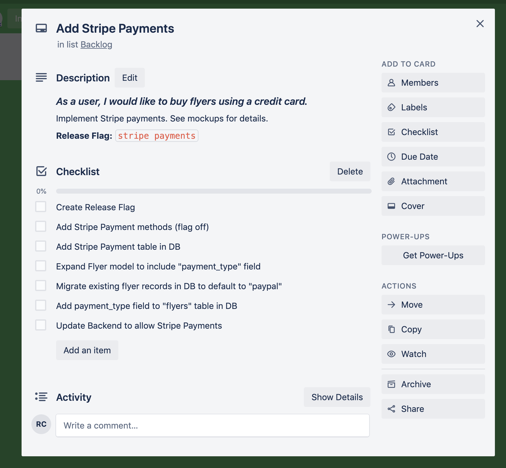
@snapend

---

Drag the task to "In Progress".

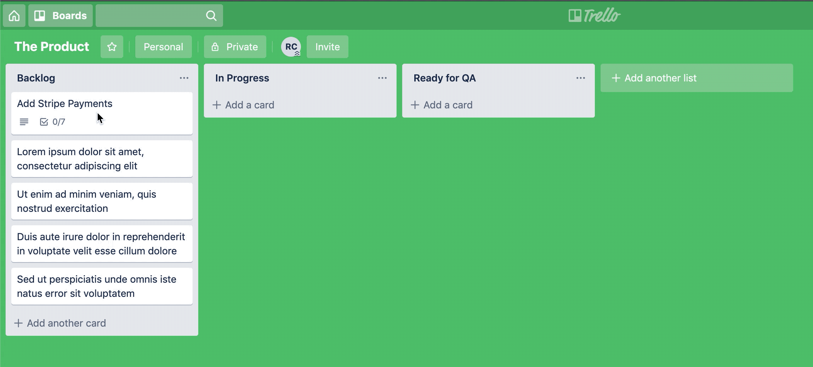

---

Pull the latest copy of our code base, make sure it's working:

```bash
git pull origin master
nvm use 
npm i
npm run build
npm test
npm run lint

# Or on my machine:
alias refresh="git pull origin master && npm use && npm i"
alias validate="npm run build && npm test && npm run lint"
alias good-morning="refresh && validate && say 'Good morning, Richard'"
```

---

Begin development!


---

@snap[north span-80]
#### Task 1: Create Release Flag
@snapend

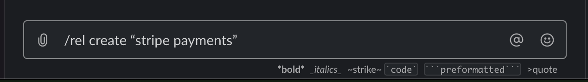

---

@snap[north span-80]
#### Task 2: Add our Stripe provider to the UI.
@snapend

```html
<PaymentMethod>
    <!-- Toggle the Stripe component -->
    <Toggle flag="release_stripe_payments">
        <PayWithStripe
            customerId={customerId}
            amount={flyerCostInCents}
            onSubmit={executeStripePayment}  /> 
    </Toggle>
    <PayWithPaypal
        amount={flyerCostInCents}
        onSubmit={executePaypalPayment}
    />
</PaymentMethod>
```

---

@snap[north span-80]
#### Write a UI Test
@snapend

```typescript
it('should allow Stripe payment with valid credit card', async () => {
    const customerId = 'foobar'
    const flyerCostInCents = 2500
    const executeStripePayment = jest.fn()
    toggle(
        'release_stripe_payments',
        <PaymentMethods
            customerId={customerId}
            amount={flyerCostInCents}
            executeStripePayment={executeStripePayment}
        />
    )
    fireEvent.click(getByText(/Submit Payment/))
    expect(executeStripePayment)
        .toHaveBeenCalledWith(customerId, flyerCostInCents, expect.anything())
})
```

---

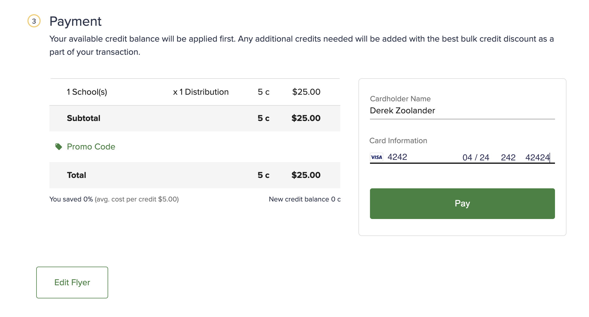

---

@snap[north span-80]
#### Task 3: Create Payment Table (migration)
@snapend

```bash
vim db/V201910132150__add_stripe_payment_table.sql
```

<hr />

```sql
create table stripe_purchases
(
	purchase_id uuid not null
		constraint purchases_pkey
			primary key,
	total_price_in_cents integer not null,
	-- ...etc, etc, etc.
);
```

---

@snap[north span-80]
#### Task 4: Expand Flyer model to include "paymentType" field
@snapend

```typescript
// Create an enum for the valid payment types
export enum PaymentTypes {
    PayPal = 'paypal',
    Stripe = 'stripe',
}

export type Flyer = {
    // ...
    // Add the payment type field
    paymentType: PaymentTypes
    // ...
}
```

---

@snap[north span-80]
#### Task 5: Add payment_type field to "flyers" table in DB
@snapend

```bash
vim db/V201910132202__add_payment_type_to_flyers_table.sql
```

<hr />

```sql
alter table flyers add payment_type varchar;
```

---

@snap[north span-80]
#### Task 6: Migrate existing flyer records in DB to default to "paypal"
@snapend

```bash
vim db/R201910132204__set_paypal_as_payment_type_for_old_records.sql
```

<hr />

```sql
update flyers set payment_type = 'paypal' where payment_type is null;
```

---

@snap[north span-80]
#### Task 7: Update Backend to allow Stripe Payments
@snapend

```typescript
// Current Implementation
app.post('/flyers', postFlyer)
```

<hr />

```typescript
// New implementation
app.post('/flyers', flagged({
    default: postFlyer,
    overrides: [{
        // @flag_created_at: 20191013
        flag: 'release_stripe_payments',
        handler: postFlyerWithStripe,
    }],
}))
```

---

@snap[north span-80]
#### Write Unit Tests
@snapend

```typescript
describe('when a Stripe payment is submitted', () => {

    let stripe: Stripe
    let db: Knex

    beforeEach(() => {
        stripe = {
            capturePayment: jest.fn(() => Promise.resolve({ id: 'foobar' }))
        }
        db = new KnexMock()
    })

    it('should capture the Stripe payment and store the result in the db', async () => {
        // ...
    })
})
```

---

@snap[north span-80]
#### Write Integration Tests
@snapend

```typescript
import request from 'supertest'
import createApp from './app'
import Factory from 'rosie'

describe('POST /flyers', () => {
  let app: Express
  beforeEach(()=> {
      app = createApp(process.env)
  })
  it('should accept Stripe payments', async () => {
    await Promise((resolve, reject) => request(app)
      .post('/flyers')
      .send(Factory.build('FlyerPostingWithStripePayment'))
      .expect(200, (error) => {
          if (error) return reject(error)
          resolve()
      });
    )
  });
});
```

---

@snap[north span-80]
#### Verify Everything works
@snapend

```bash
npm run build
npm run coverage
npm run coverage:integ
npm run lint
```

---

@snap[north span-80]
#### Commit and push our changes
@snapend

```
git add .
git commit -m 'Implements DEV-1234 Stripe Payment'
git push origin master
```

---

Snack time!


---

@snap[north span-100]
Meanwhile, our code is built, tested, and deployed.
@snapend

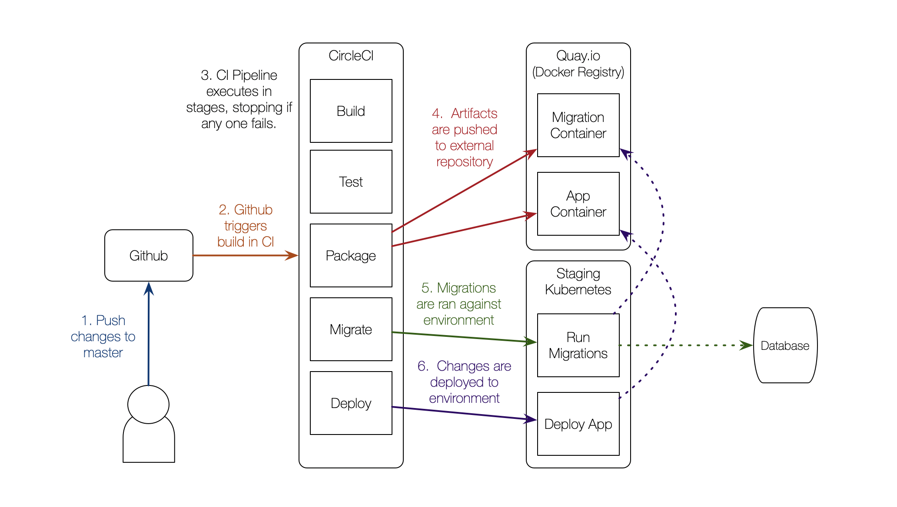

---

We receive a Slack message, staging deployment successful!

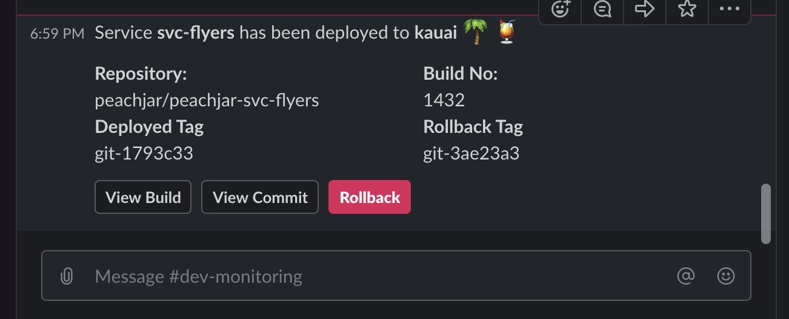

---

Signal QA the feature is ready for validation.

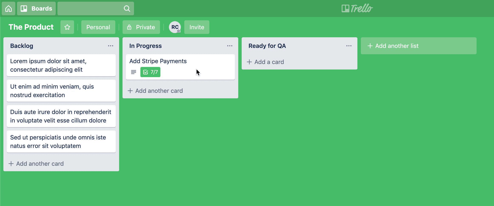

---

Give QA a heads up that this feature is ready.

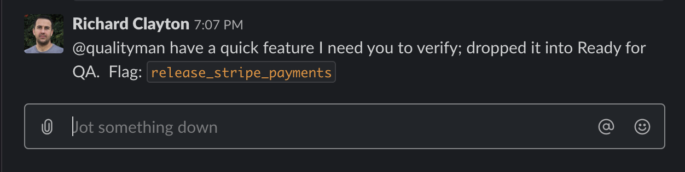

---

QA pulls the task for verification.

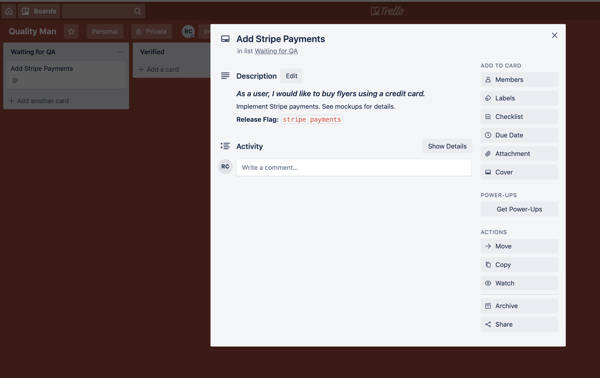

---

Stage release in Slack


---

QA requests changes.

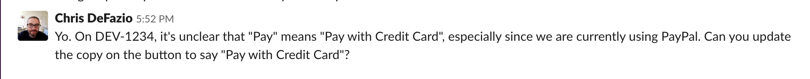

---

Dev feeling lazy after that post-feature snack...

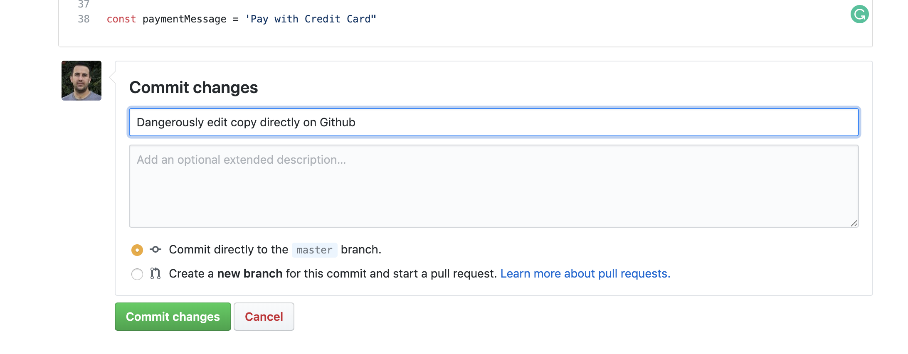

---

Build failure!

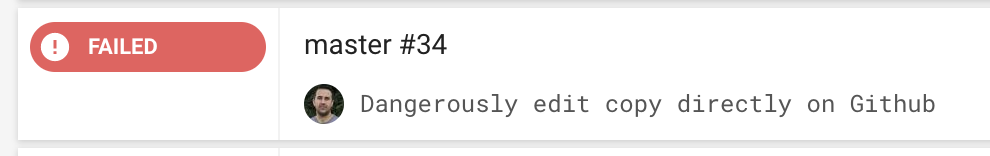

---

Pull repo, fix error, push changes.

```bash
git pull origin master
nvm use && npm i && npm run build && npm run lint && npm test
```

<hr />

```typescript
// DERP.
// const paymentMessage = 'Pay with Credit Card"
const paymentMessage = 'Pay with Credit Card'
```

<hr />

```bash
npm run build && npm run lint && npm test
git add .
git commit -m 'Fixed my malfunction.  What is wrong with me?'
git push origin master
```

---

Build Fixed.


---

Signal QA that the Copy Change has been made.

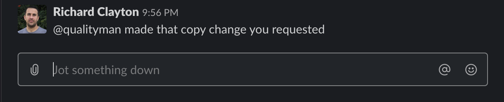

---

QA Reviews the change, approves.

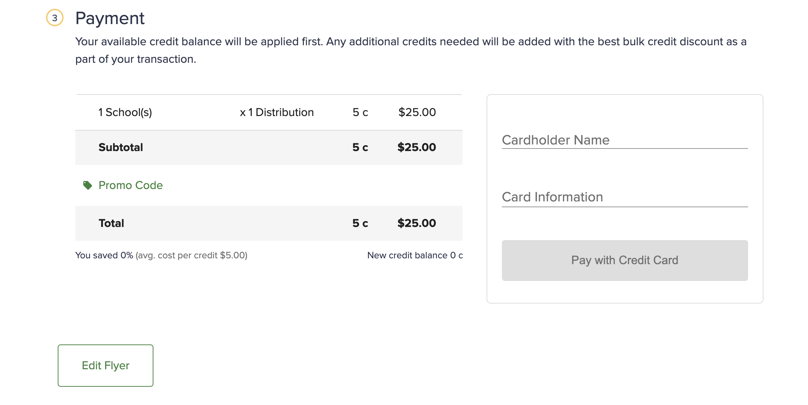

---

QA "prereleases" feature.


---?image=assets/video-games.gif

---

Code pushed to production (but off)

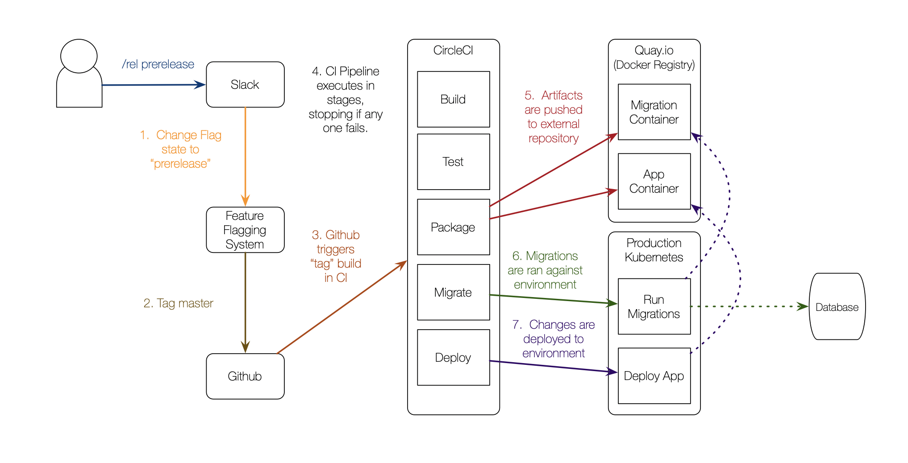

---

QA Verifies Feature


---

Sometime in the near future...


---

QA Releases the Feature


---?image=https://media.giphy.com/media/l0MYt5jPR6QX5pnqM/giphy.gif

---

QA Closes Feature (Released!)

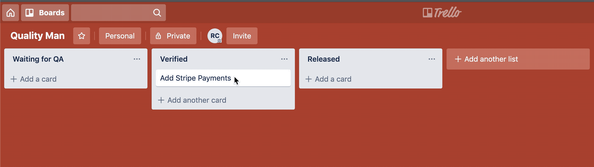

---

Maybe that's not the best example, but it does demonstrate many of the principles of Continuous Delivery.

---

### Prinicipals of Contiuous Delivery

@ul
- Build quality in
- Work in small batches
- Computers perform repetitive tasks, people solve problems
- Relentlessly pursue continuous improvement
- Everyone is responsible
@ulend

@snap[fragment]
https://continuousdelivery.com/principles/
@snapend

Note:
- Unit tests, local integration tests, type correctness, linting, code coverage, etc.  But this also includes practices like Agile, Domain Driven Design, continuous learning.
- Continously push dev changes to trunk.  Turn features off if you have to (feature flags).  Split features across deployments, releases (Expand and Contract).  Divorce the concept of release and deployment.
- Improvement never ends.  Investments in quality and automation increases velocity.
- Devs are as responsible for Quality as QA.  QA plays a part in planning.  Engineers help in design.  Devs operate and support the system.

---

### Roadmap to CD

---

@snap[north span-90]
#### 1.  Get your stuff building on another machine
@snapend

@ul
- Use version control
- Build code on another machine (i.e. CI Server) when pushed
- Report build fails
- Increase confidence by increasing unit test coverage
- **Correct build failures immediately!**
@ulend

---

@snap[north span-90]
#### 2.  Automate Deployments (CD)
@snapend

@ul
- Package application for deployment (is it portable?)
- Automate the configuration life cycle
- Will your app start?  Try it in CI.
- Automate deployment locally (your box)
- Script that same deployment in your CI environment.

@ulend

---

@snap[north span-90]
#### 3.  Deploy Automatically
@snapend

@ul
- Adopt simple deployment conventions
  - Commit on master deploys to staging
  - Tag or production branch goes to production
- Gate production deployments if needed.
- Small deltas in deployments (no long lived branches)
- Roll forward as much as possible
@ulend

---

@snap[north span-90]
#### 4.  Continuous Deployment
@snapend

@ul
- Flagging/Toggles are essential
- Increase confidence with Integration/E2E Tests
- Smoke Tests
- Automate Rollbacks
@ulend

---

### Conclusion

@ul
- Provide a practical understanding of CI/CD.
- Demonstrate how it is used with the development process.
- Discuss the principals of Continuous Delivery.
- Offer advice on how to start incorporating CD practices immediately.
@ulend

---

### Questions?
