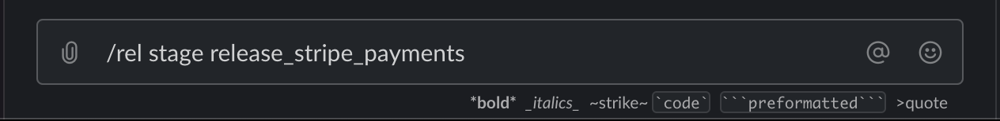
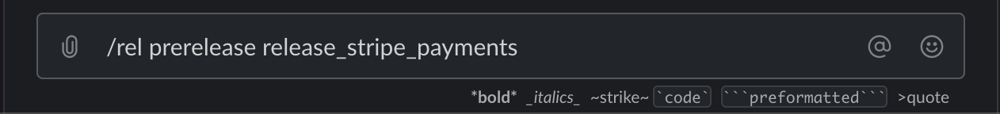
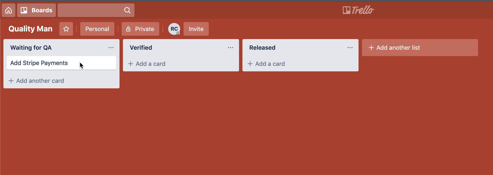

---

@snap[midpoint span-100]
### Continuous Delivery is Within Reach!
@snapend

@snap[south-east span-20]

@snapend

---

@snap[north span-80]
## Overview
@snapend

@ul
- Demonstrate a CD workflow via anecdote.
- Discuss the tenants of CI/CD
- Provide a simple roadmap of to achieve CD.
@ulend
---


It was a bright and early morning.

@snap[fragment]
Our protaganist sidles up to his desk and takes the next item in the backlog...
@snapend

---


---


---?terminal=term/faster.cast&autoplay=true&title=Pull Latest and Verify Repo

nvm use && npm i && npm run build && npm test && npm run lint

---

Coding engage!


---

@snap[north span-80]
#### Task 1: Create Release Flag
@snapend


---

@snap[north span-80]
#### Task 2: Add our Stripe provider to the UI.
@snapend

```html
<PaymentMethod>
    <!-- Toggle the Stripe component -->
    <Toggle flag="release_stripe_payments">
        <PayWithStripe
            customerId={customerId}
            amount={flyerCostInCents}
            onSubmit={executeStripePayment}  /> 
    </Toggle>
    <PayWithPaypal
        amount={flyerCostInCents}
        onSubmit={executePaypalPayment}
    />
</PaymentMethod>
```

---

@snap[north span-80]
#### Write a UI Test
@snapend

```typescript
it('should allow Stripe payment with valid credit card', async () => {
    const customerId = 'foobar'
    const flyerCostInCents = 2500
    const executeStripePayment = jest.fn()
    toggle(
        'release_stripe_payments',
        <PaymentMethods
            customerId={customerId}
            amount={flyerCostInCents}
            executeStripePayment={executeStripePayment}
        />
    )
    fireEvent.click(getByText(/Submit Payment/))
    expect(executeStripePayment)
        .toHaveBeenCalledWith(customerId, flyerCostInCents, expect.anything())
})
```

---


---

@snap[north span-80]
#### Task 3: Create Payment Table (migration)
@snapend

```bash
vim db/V201910132150__add_stripe_payment_table.sql
```

<hr />

```sql
create table stripe_purchases
(
	purchase_id uuid not null
		constraint purchases_pkey
			primary key,
	total_price_in_cents integer not null,
	-- ...etc, etc, etc.
);
```

---

@snap[north span-80]
#### Task 4: Expand Flyer model to include "paymentType" field
@snapend

```typescript
// Create an enum for the valid payment types
export enum PaymentTypes {
    PayPal = 'paypal',
    Stripe = 'stripe',
}

export type Flyer = {
    // ...
    // Add the payment type field
    paymentType: PaymentTypes
    // ...
}
```

---

@snap[north span-80]
#### Task 5: Add payment_type field to "flyers" table in DB
@snapend

```bash
vim db/V201910132202__add_payment_type_to_flyers_table.sql
```

<hr />

```sql
alter table flyers add payment_type varchar;
```

---

@snap[north span-80]
#### Task 6: Migrate existing flyer records in DB to default to "paypal"
@snapend

```bash
vim db/R201910132204__set_paypal_as_payment_type_for_old_records.sql
```

<hr />

```sql
update flyers set payment_type = 'paypal' where payment_type is null;
```

---

@snap[north span-80]
#### Task 7: Update Backend to allow Stripe Payments
@snapend

```typescript
// Current Implementation
app.post('/flyers', postFlyer)
```

<hr />

```typescript
// New implementation
app.post('/flyers', flagged({
    default: postFlyer,
    overrides: [{
        // @flag_created_at: 20191013
        flag: 'release_stripe_payments',
        handler: postFlyerWithStripe,
    }],
}))
```

---

@snap[north span-80]
#### Write Unit Tests
@snapend

```typescript
describe('when a Stripe payment is submitted', () => {

    let stripe: Stripe
    let db: Knex

    beforeEach(() => {
        stripe = {
            capturePayment: jest.fn(() => Promise.resolve({ id: 'foobar' }))
        }
        db = new KnexMock()
    })

    it('should capture the Stripe payment and store the result in the db', async () => {
        // ...
    })
})
```

---

@snap[north span-80]
#### Write Integration Tests
@snapend

```typescript
import request from 'supertest'
import createApp from './app'
import Factory from 'rosie'

describe('POST /flyers', () => {
  let app: Express
  beforeEach(()=> {
      app = createApp(process.env)
  })
  it('should accept Stripe payments', async () => {
    await Promise((resolve, reject) => request(app)
      .post('/flyers')
      .send(Factory.build('FlyerPostingWithStripePayment'))
      .expect(200, (error) => {
          if (error) return reject(error)
          resolve()
      });
    )
  });
});
```

---

@snap[north span-80]
#### Verify Everything works
@snapend

```bash
npm run build
npm run coverage
npm run test:integ:coverage
npm run lint
```

---

@snap[north span-80]
#### Commit and push our changes
@snapend

```
git add .
git commit -m 'Implements DEV-1234 Stripe Payment'
git push origin master
```

---

Snack time!


---

@snap[north span-100]
Meanwhile, our code is built, tested, and deployed.
@snapend


---

We receive a Slack message, staging deployment successful!


---

Signal QA the feature is ready for validation.


---

Give QA a heads up that this feature is ready.


---

QA pulls the task for verification.


---

Stage release in Slack



---

QA requests changes.


---

Dev feeling lazy after that post-feature snack...


---

Build failure!


---

Pull repo, fix error, push changes.

```bash
git pull origin master
nvm use && npm i && npm run build && npm run lint && npm test
```

<hr />

```typescript
// DERP.
// const paymentMessage = 'Pay with Credit Card"
const paymentMessage = 'Pay with Credit Card'
```

<hr />

```bash
npm run build && npm run lint && npm test
git add .
git commit -m 'Fixed my malfunction.  What is wrong with me?'
git push origin master
```

---

Build Fixed.


---

Signal QA that the Copy Change has been made.


---

QA Reviews the change, approves.


---

QA "prereleases" feature.



---

QA break time.


---

Code pushed to production (but off)


---

QA Verifies Feature



---

Sometime in the near future...


---

QA Releases Feature


---

NO CODE DEPLOYMENT NECESSARY!!!!

FEATURE IS ENABLED FOR ALL USERS.

---

QA Closes Feature (Released!)


